<div align="center">
  
  <br />
  <br />
  
  <h1>🍔 OrderXpress POS</h1>
  <p><b>A Modern, Lightning-Fast Full Stack Point of Sale & Inventory Management System</b></p>

  <p>
    
    
    
    
    
    
  </p>
</div>

---

**OrderXpress** is a premium, high-performance **Full Stack** Point of Sale (POS) and inventory management system designed specifically for fast-paced restaurants, cafes, and retail stores. It merges a beautiful, dynamic user interface with robust backend operations to deliver lightning-fast checkout flows.

---

## ✨ Key Features

- **⚡ Lightning Fast POS Interface:** Optimized Next.js 15 routing for instant category switching and cart management.
- **🌐 Full Stack Architecture:** Complete end-to-end solution featuring a React/Next.js frontend and integrated Next.js API route backend.
- **💳 Multi-Gateway Payment Support:** Fully integrated with Stripe Checkout for secure credit/debit card processing, alongside native wallet tracking (Google Pay, PhonePe, Paytm) and Cash tracking.
- **📦 Real-Time Inventory & DB:** Powered by MongoDB Atlas. Products and transaction histories are instantly synced to the cloud.
- **🎨 Stunning UI/UX:** Built with Tailwind CSS v4 and Framer Motion for smooth, dynamic animations, hover effects, and a premium "glassmorphism" aesthetic.
- **📊 Admin Dashboard:** Comprehensive backend management portal to track recent orders, manage customer profiles, and update product inventory on the fly.
- **🌙 Dark Mode Support:** Seamless toggling between light and dark themes using `next-themes` and Shadcn UI components.
- **🧾 Automated Digital Receipts:** Auto-generates beautifully crafted printable order receipts upon successful payment routing.

## 🛠️ Tech Stack

- **Frontend:** Next.js 15 (App Router), React 19, TypeScript
- **Styling:** Tailwind CSS v4, Radix UI, Shadcn UI, Framer Motion
- **Backend:** Next.js Serverless API Routes
- **Database:** MongoDB & Mongoose
- **Payments:** Stripe API (`stripe-node`)
- **Icons:** Lucide React

---

## 🏗️ System Architecture & Workflow

Here's a flowchart visualizing how the OrderXpress full-stack ecosystem interacts from browsing to checkout:

```mermaid
sequenceDiagram
    autonumber
    participant U as 👤 User/Admin
    participant UI as 🖥️ Next.js Frontend
    participant API as ⚙️ Next.js API Routes
    participant M as 🗄️ MongoDB Atlas
    participant S as 💳 Stripe API

    U->>UI: Browse Menu / Manage Items
    UI->>API: Fetch Products/Inventory Data
    API->>M: Query Database
    M-->>API: Return Data
    API-->>UI: Serve Items to Display

    U->>UI: Add Items to Cart & Checkout
    UI->>S: Process Secure Payment
    S-->>UI: Payment Success webhook/response

    UI->>API: Send Order Confirmation
    API->>M: Save Order & Deduct Inventory
    M-->>API: Database Updated
    API-->>UI: Transaction Complete
    UI-->>U: Generate Digital Receipt
```



---

### 📦 Dependency Graph

Here is a visual breakdown of the `package.json` structure, illustrating our scripts, runtime dependencies, and devDependencies:


## 🚀 Getting Started

### Prerequisites

Make sure you have Node.js (v18+) and npm installed on your machine.

### 1. Clone the repository

```bash
git clone https://github.com/CodeWithBasu/OrderXpress.git
cd OrderXpress
```

### 2. Install Dependencies

```bash
npm install
```

### 3. Environment Configuration

Create a `.env.local` file in the root directory and add your database and payment API keys.

```env
# MongoDB Atlas Connection URI
MONGODB_URI=mongodb+srv://<username>:<password>@cluster.mongodb.net/OrderXpressDB

# Stripe Payment Keys
NEXT_PUBLIC_STRIPE_PUBLISHABLE_KEY=pk_test_...
STRIPE_SECRET_KEY=sk_test_...
```

_(Note: To test card payments, ensure your Stripe keys are set to "Test Mode". To accept real money, swap them for "Live Mode" keys)._

### 4. Seed the Database

If you are starting fresh, you can optionally populate your database with our beautiful artisanal starter menu (Burgers, Pizzas, Desserts, Mocktails, etc.):

```bash
node seed.js
```

### 5. Run the Development Server

```bash
npm run dev
```

Open [http://localhost:3000](http://localhost:3000) with your browser to launch the POS terminal. Access the management dashboard at `http://localhost:3000/admin`.

## 🔒 Security Note

This application connects to an external MongoDB Atlas cluster. If you encounter a `500 Internal Server Error` when loading products, ensure that your current IP address is whitelisted in your MongoDB Atlas **Network Access** settings.

---

<div align="center">
  <p>Built with ❤️ by <a href="https://github.com/CodeWithBasu">CodeWithBasu</a></p>
</div>
